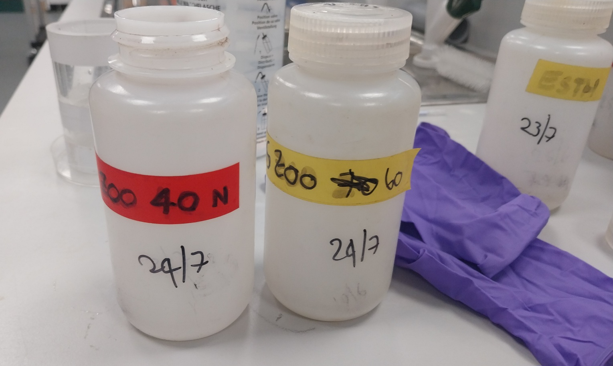
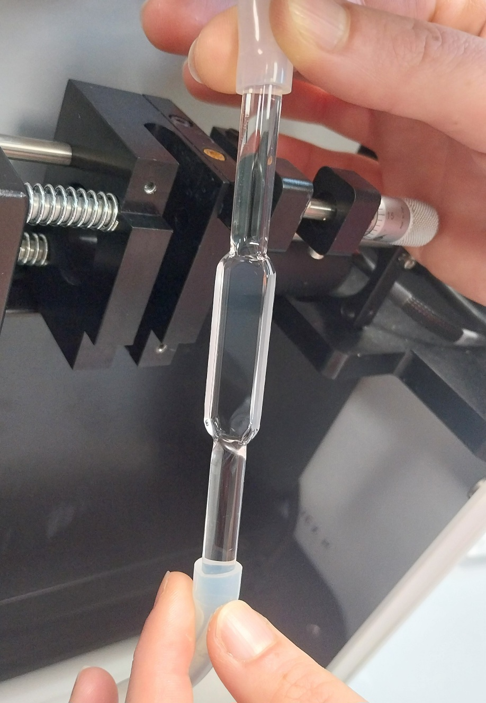
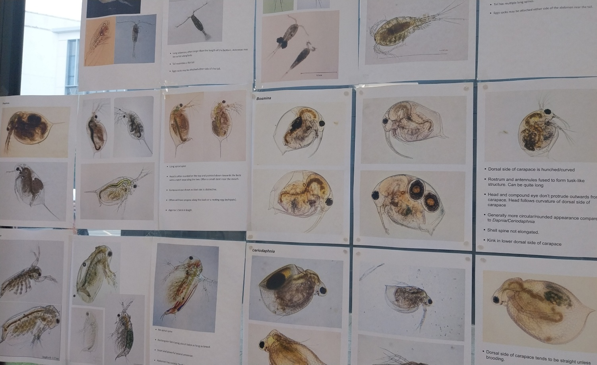
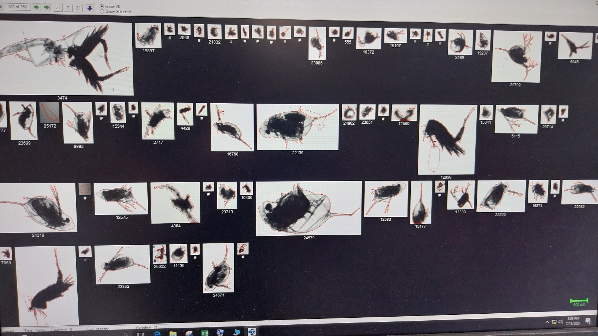
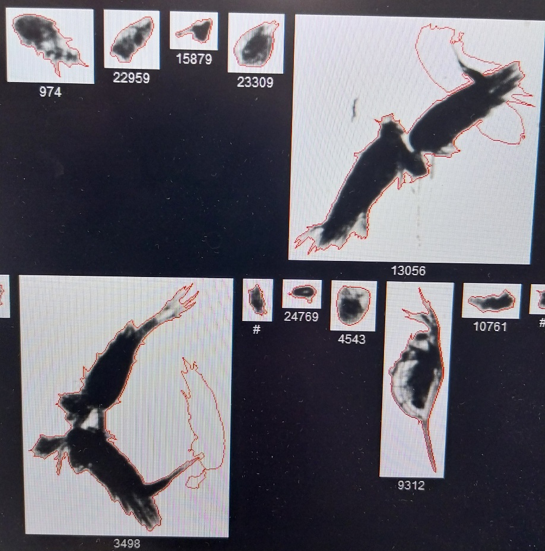
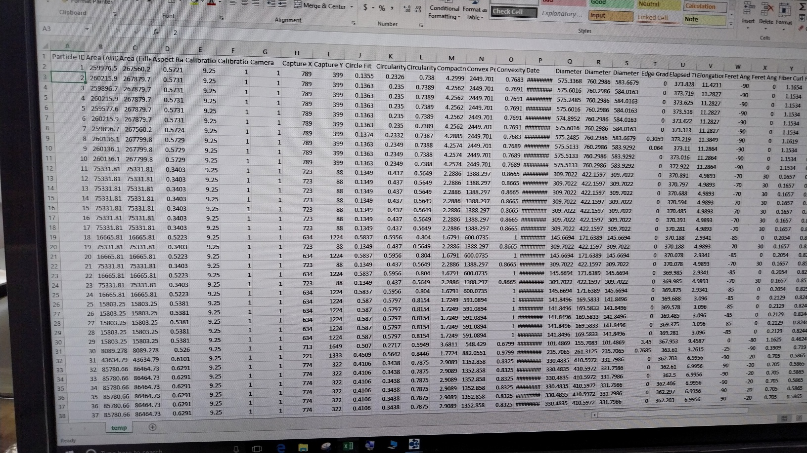
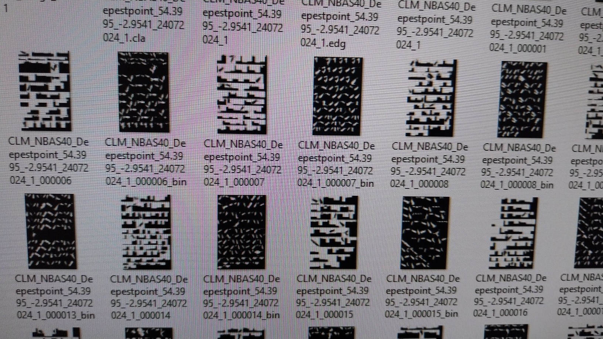
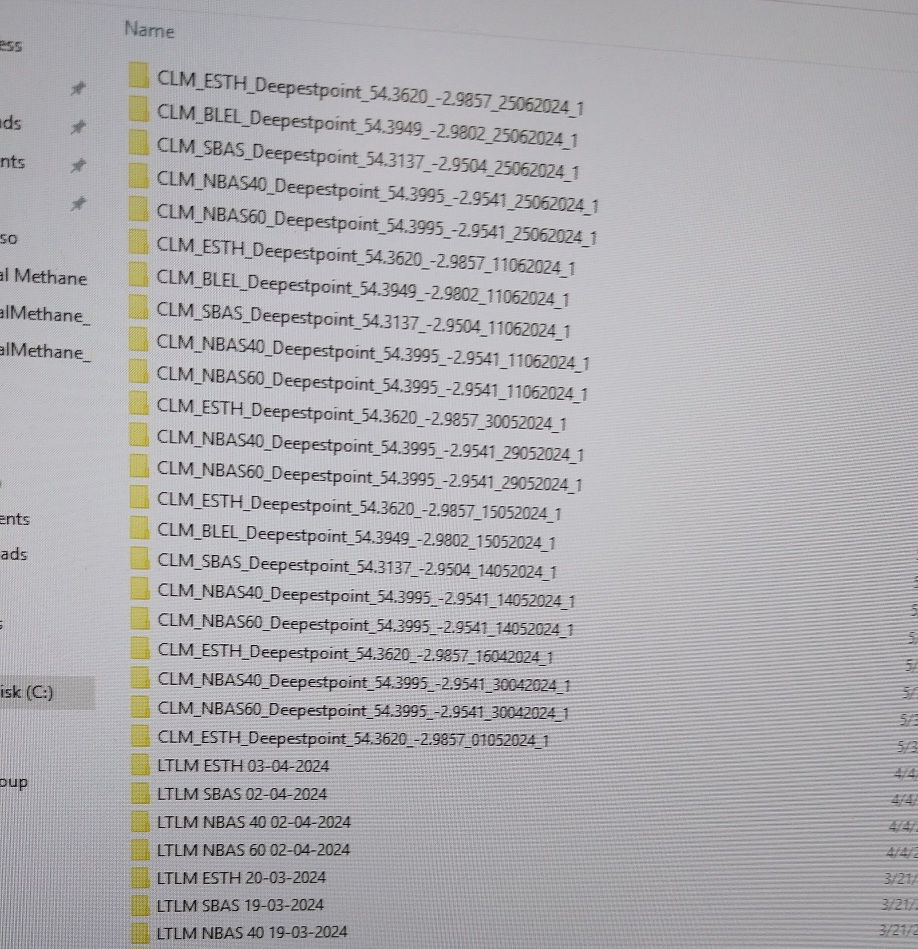
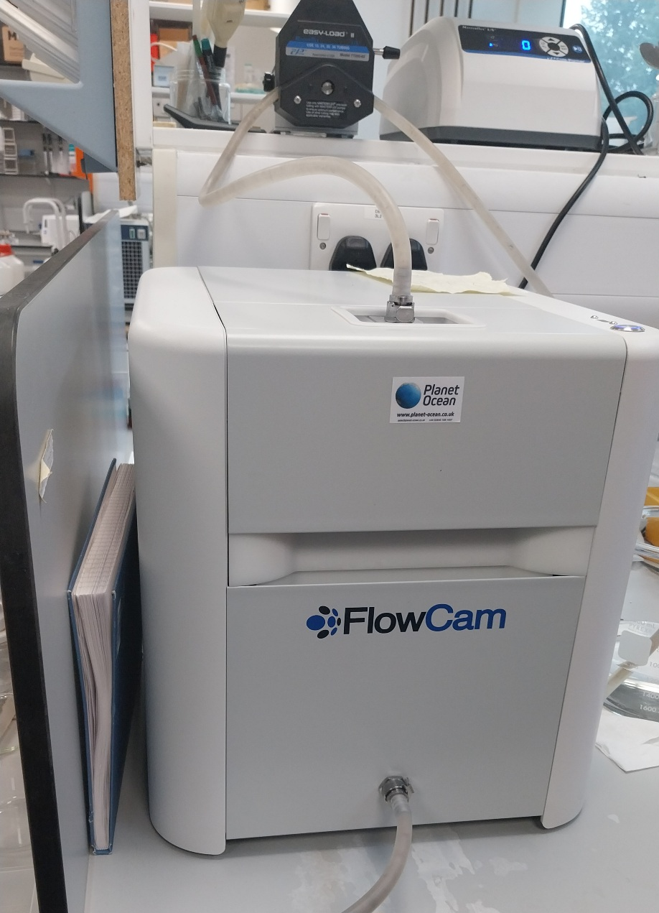
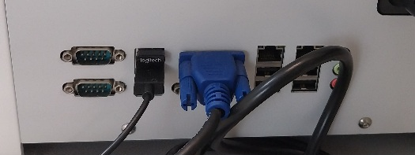

---
# Feel free to add content and custom Front Matter to this file.
# To modify the layout, see https://jekyllrb.com/docs/themes/#overriding-theme-defaults

layout: home
title: Plankton ML - FlowCam walkthrough
---

# FlowCam walkthrough

Report of a visit to the FlowCam instrument in Lancaster on 25/07/2024 to see the flow from specimen to analysis data, see the interpretation through researcher's eyes, understand the problem better.

## Sampling

The samples are collected once every two weeks. At this stage the plankton are suspended in ether. The ones we analysed had been collected a day or two earlier.

They're washed through a very fine sieve and then diluted back into a beaker of water. 

The diluted sample runs through the hose and between this flat section with two glass plates, which is where the camera points.

Sampling through analysis involves swirling a hose through the water while it pumps through the flat section at an adjustable pressure.

<video height="640" controls>
  <source src="images/YouCut_20240729_124027460.mp4" type="video/mp4"/>
  
</video>

At this stage the researchers are looking for relative volumes of half a dozen plankton genus, with an index to their types and typical features helpfully printed out and stuck to the window.

An onboard model does basic object detection of specific plankton as they pass through the flat section. You can see that it's picking up _a lot_ of empty space - either slightly out of sync with the flow through the device, or with a very low threshold of acceptance for what it perceives as possibly plankton, or both. 

<video width="640" controls>
  <source src="images/YouCut_20240729_123745260.mp4" type="video/mp4"/>
Short video of the FlowCam in action, stream through the device on the right, output of object detection on the left
</video>

This results in a set of "collage" images which are what we see _at the start of_ the pipeline in this project. In the sample we recorded, there were 350 pages of these and over 250 of them were purely blank images.

There's quite a lot of computer vision happening onboard the FlowCam. Here it's doing edge detection and deriving a set of metrics for shapes (area, circularity, complexity) which could be used for shallow ML approaches.

We don't see a data dump of these in a way that can be recoupled with the exported collage images - I'm told that involves a licence that we don't have resource for - or any sign of a programmatic interface for development on the FlowCam. 

There's an amount of potentially interesting intermediate image data left behind on the device - including snapshots of the raw flow through the camera, and all the binary masks of the collages from which the shape analysis is done.

The exported collage images are managed using a file naming convention which includes geographic location (WGS84 lon/lat) and sample depth as well as date. This is getting detached from the single-plankton images in the current workflow, and we very much need to preserve it. I'd wondered if depending so heavily on file naming conventions was an overhead, but it looks like a good affordance for the researcher's workflow in the FlowCam application; they take the previous session and tweak a small part of the filename. 

The FlowCam unit has a built in PC running Windows, rather than attaching to an external one. I didn't ask what version, whether there's any lifecycle for it receiving updates, or whether support through updates has an extra manufacturer cost.

It's got ethernet available, but isn't connected to the network, the reason cited being the default implementation of Cyber Essentials Plus for risk management - transfer of data is done via USB stick, and when the disk fills with intermediate images they're just deleted.

## Next steps

* [Diagrams](../diagrams/) show the as-is and could-be versions of a data pipeline which takes the exported FlowCam images, breaks them back down into single plankton samples and publishes them to an object store for use with model building
* The workflow loses metadata at too many points, though a lot of it's knitted up by the file naming convention
* The arduous part from the researcher POV is paging through images classifying them by hand and eye. A model interpretation of them retrospectively, done in the cloud, isn't going to reduce the immediate work in the lab; at worst it risks casualising it, by reducing the _apparent_ need for expertise in interpretation at the point of sampling
* Recommendation is to take small steps (a "hello world" python application, then `scikit-image`, then a pytorch based classifier) to run models on the instrument itself as a direct assistance to the researcher. For a single-purpose application that's hard to justify, but as a feasibility test of general approach influencing future design (there's already precedent for [running .net applications directly on a flow cytometer](https://github.com/OBAMANEXT/cyz2json)) it's quite interesting

